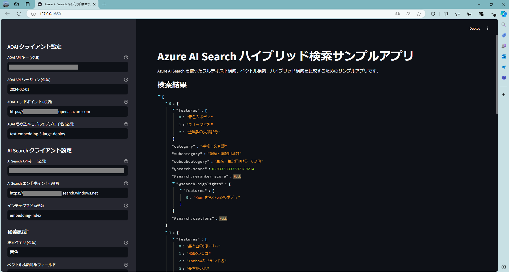

# hybrid-search-sample-app
本リポジトリには、Azure AI Search


## 前提条件
- Azure AI Search がデプロイされていること
- ベクトルフィールドを持つインデックスが作成されていること
- Azure OpenAI Service がデプロイされていること
- 埋め込みモデルがデプロイされていること
- Python のプログラムの実行に必要な各ライブラリのインストールが可能であること

## 利用手順
以下のコマンドを実行するか、ZIP ダウンロードをすることでソースコードを取得する。
```
git clone https://github.com/yus04/hybrid-search-sample-app.git
```

以下のコマンドを実行し、プログラムの実行に必要なライブラリをインストールする。

```
pip install -r requirements.txt
```

以下のコマンドを実行し、Streamlit アプリケーションサーバーを起動する。
```
streamlit run app.py
```
サーバーが起動したら http://localhost:8501 にアクセスする。

## params.txt の形式について
AOAI クライアント設定、AI Search クライアント設定、検索設定に関するパラメーター情報を params.txt に保存しています。params.txt は以下の形式で保存されており、セミコロンの後に登録している各パラメーター値が保存されます。
```
aoai_api_key;
aoai_api_version;
aoai_endpoint;
aoai_embedding_model;
ai_search_api_key;
ai_search_endpoint;
index_name;
query;
vector_fields;
search_mode;
filter;
highlight_fields;
query_type;
search_fields;
select;
top;
```